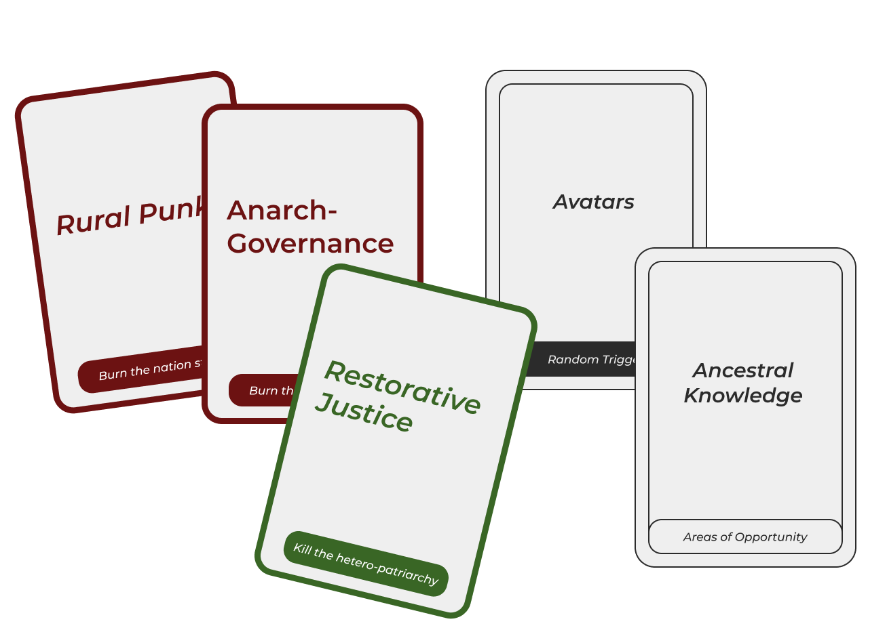
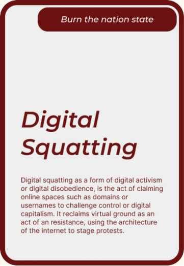
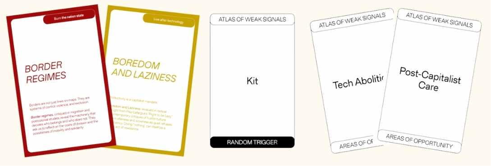

    

        <a href="../..">MDEF</a>
        <a href="../../projects/Portfolio">Projects</a>
        <a href="../../about/me">About me</a>
    

<!-- Imagen completa -->
  

 

<!-- Diagrama de Venn simplificado -->

        

            <!-- Círculo 1: Rural Punk -->
            

                
Rural Punk

            

            
<!-- Círculo 2: Anarch Governance -->

                
Anarch Governance

            

            
<!-- Círculo 3: Restorative Justice -->

                
Restorative Justice

            

            
<!-- Random Triggers -->

                
Avatars

                
Ancestral Knowledge

            

            

    

<!-- Contenedor de dos columnas: Imagen y Definición -->

        

             
        

        

            

                <h3>Digital Squatting:</h3>
                
As a form of digital activism or digital disobedience, is the act of claiming online spaces such as domains or usernames to challenge control and digital capitalism. It reclaims virtual ground as an act of resistance, using the architecture of the internet to stage protests.

            

            
 <!-- Equipo -->

                
<strong>Weak Signal worked in team:</strong> Sila, Ishan, Ludo, Aishwarya, Erandi, Francesco

            

        

    

<!-- Video de YouTube -->
   

        

            <iframe 
                src="https://www.youtube.com/embed/0VJFyfiYXVs" 
                title="Atlas of Weak Signals"
                frameborder="0" 
                allow="accelerometer; autoplay; clipboard-write; encrypted-media; gyroscope; picture-in-picture" 
                allowfullscreen>
            </iframe>
        

        
Atlas of Weak Signals - Digital Squatting

    

<!-- Nueva imagen cards2.jpg -->

    

<!-- Nuevo diagrama Post-Capitalist Care -->

    <h2 class="diagram-title">Post-Capitalist Care Framework</h2>
    

        <!-- Nodo central -->
        

            

                <h3>Post-Capitalist Care</h3>
            

        

        
<!-- Rama 1: Tech Abolition -->

            

            

                

                    <h4>Tech Abolition</h4>
                    
Rethinking technology beyond capitalist paradigms

                

            

            

                

                

            

            

                

                    Kit
                

            

        

        
 <!-- Rama 2: Border Regimes -->
   

            

            

                

                    <h4>Border Regimes</h4>
                    
Challenging territorial and social boundaries

                

            

            

                

                

            

            

                

                    Kit
                

            

        

        
<!-- Rama 3: Boredom and Laziness -->
 

            

            

                

                    <h4>Boredom and Laziness</h4>
                    
Reclaiming time and resisting productivity culture

                

            

            

                

                

            

            

                

                    Kit
                

            

        

    

