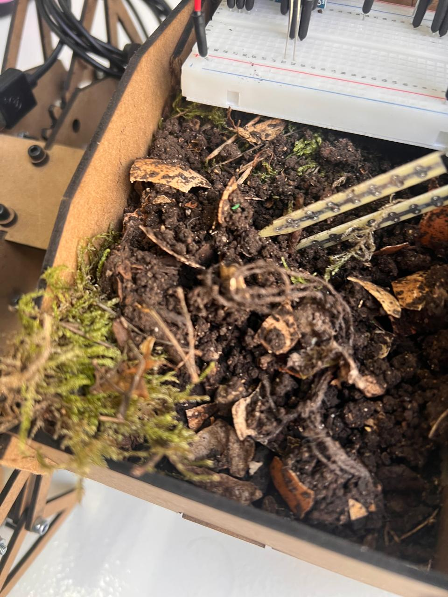
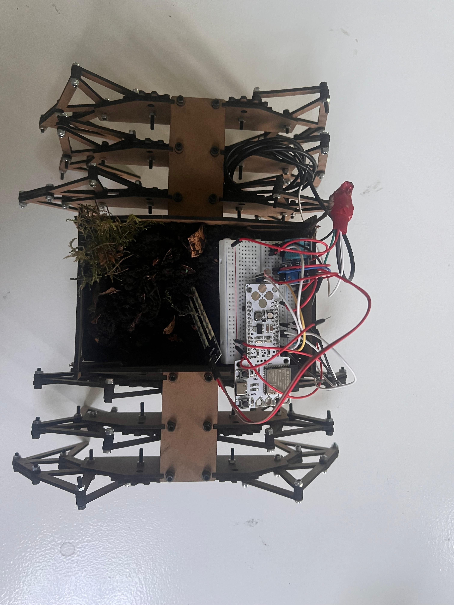

    

        <a href="../..">MDEF</a>
        <a href="https://eradesign.portfolio.site/" target="_blank" rel="noopener noreferrer">Projects</a>
        <a href="../../about/me">About me</a>
    

# Nomadic Infrastructure for Urban Microecosystems  
### Individual Reflective Post  

## Project Introduction  

This project started from a discomfort. Cities are designed almost exclusively for humans. Shade, ventilation, mobility, comfort, protection. All optimized for us. Meanwhile, insects and small organisms experience the city as an unstable and often hostile territory. Heat accumulates, soil dries out, surfaces radiate temperature, and exposure shifts constantly throughout the day.

The city is not static. Environmental hostility moves. Shade disappears. Pavement heats up. Moisture evaporates. So the question changed. What if infrastructure could move in response?

Inspired by walking mechanisms like the Strandbeest system, the project shifted from object to organism. Instead of designing a container, we designed something that senses and reacts. The idea became less about protection and more about mobility as survival.

> **Note:** This documentation is a personal reflection. For collaborative context and full technical details, visit:  
> **[Full Group Documentation on Hackster.io →](https://www.hackster.io/antoniogarciafernandez/nomadic-infrastructure-for-urban-microecosistems-b799ea)**  

---

## 1. Cognitive Trace  

    
Trying to design from a non‑human perspective exposed a limitation. We cannot fully understand how insects experience temperature or dryness. What we can do is translate environmental variables into measurable signals. Soil humidity, light intensity, temperature. These become our way of approximatin environmental stress. It is an imperfect translation, but it makes response possible.

---

## 2. Moral Trace  

    
Designing for other species is not neutral. There is an ethical tension in deciding what conditions are “better” and when movement should happen. We defined the thresholds. We determined when the environment becomes hostile. That means the autonomy of the artifact is always framed by human assumptions.

    
At the same time, cities distribute vulnerability unevenly. Some species can escape heat or dryness. Others cannot. This project explores whether mobility can act as a small redistribution mechanism. It does not fix urban injustice, but it tries to create a moving pocket of survivability.

    
Another question that stayed with me is intervention versus coexistence. Are we supporting life, or are we imposing another layer of artificial control? The artifact carries living matter. It becomes less about performance and more about care.

---

## 3. Technical and Process Trace  

### Mechanical system  

We built a 12‑leg walking structure based on the Theo Jansen mechanism. The assembly was much more delicate than expected. The system is extremely precise. If one screw is slightly misaligned or tightened too much, the whole walking pattern collapses. Precision is not aesthetic here, it is structural necessity.

    
    

During the time we had, the servo motors did not function as they should. Because the model we chose is so sensitive, any small mechanical inconsistency amplified the failure. We now know that we will need to change the gears and weld some of the nuts in place to ensure the central axis works as it should and the movement remains stable.

Failure here was informative. It showed that mechanical ecosystems are fragile assemblies.

### Sensing and electronics  

We integrated three sensors: soil moisture, light sensitivity through an LDR, and temperature and humidity with the DHT11. These sensors feed the ESP32 and determine when the motors should activate.

    <h3 style="margin-top: 0;">Sensor logic</h3>
    
The challenge was not only wiring and coding, but deciding the logic. What counts as too dry? Too hot? Too exposed? Those thresholds are design decisions disguised as technical parameters.

    
The movement itself is reactive and simple. The artifact does not navigate intelligently. It moves when conditions exceed limits. It searches blindly. In that sense it behaves more like a primitive organism than a robot.

### Terrarium integration  

We designed and laser cut a terrarium in MDF to host soil, moss and worms. Integrating living matter into a moving structure introduced new constraints. Weight distribution, vibration, ventilation. The more we stabilized the ecosystem, the harder it became to move it.

---

## 4. Review and Future Direction  

    
Today, February 13, we had a review session with Grandeza Studio. Their feedback shifted the scale of the project. They suggested thinking beyond a single artifact and imagining how these systems could function in the future as ecological corridors.

    
That idea expanded the scope. Instead of isolated moving microecosystems, what if multiple units could operate across the city? What if each one hosted different microhabitats? Some optimized for humidity‑dependent organisms, others for pollinators, others for decomposers. Together they could form a distributed network of moving ecological infrastructure.

    
This reframes the artifact from prototype to speculative infrastructure model. It becomes less about one walking object and more about how cities could integrate nomadic ecological support systems.

---

## 5. What This Prototype Is  

    
This is not a finished solution. It is a working question. Can infrastructure become mobile care? Can mechanical systems redistribute environmental conditions?

    
The fact that the motors failed to perform properly is part of the narrative. It reveals the complexity of translating ecological ideas into mechanical reality. Precision matters. Energy matters. Weight matters. Care is not abstract. It is mechanical.

---

## 6. Next Steps  

    
    <!-- Left Column -->
    

        <h3 style="margin-top: 0;">If we continue developing this project, the priorities would be:</h3>
        <ul style="line-height: 1.8;">
            <li>Modifying the gears so the transmission of movement is more stable</li>
            <li>Securing and reinforcing the central axis so it rotates properly</li>
            <li>Welding some nuts in place to prevent unwanted loosening</li>
            <li>Carefully testing and recalibrating the servo motors to ensure they provide enough torque and synchronized movement</li>
        </ul>
        
Right now the main limitation is not conceptual, it is mechanical reliability. The walking system depends on precision, and small inconsistencies affect the entire structure.

    

    
    <!-- Right Column -->
    

        <h3 style="margin-top: 0;">Further exploration:</h3>
        
Beyond fixing the mechanics, the next layer of development would focus on the logic of the system.

        <ul style="line-height: 1.8;">
            <li>Revisiting the code to define more precisely when the artifact moves and why</li>
            <li>Studying the actual habitat needs of the organisms inside the microecosystem, including how long they need light, darkness, specific humidity levels and temperature ranges</li>
            <li>Refining the thresholds so they respond not only to general conditions but also to time of day and duration of exposure</li>
        </ul>
        
        <h3 style="margin-top: 1.5rem;">The current code operates on broad environmental conditions. It does not yet consider cycles or temporal patterns, which are essential in real ecosystems.</h3>
        
        <h3 style="margin-top: 1.5rem;">Another important improvement would be:</h3>
        <ul style="line-height: 1.8;">
            <li>Adding proximity sensors or small cameras to prevent collisions and allow safer navigation</li>
        </ul>  
        
        <h3 style="margin-top: 1.5rem;">And at a larger scale:</h3>
        <ul style="line-height: 1.8;">
            <li>Exploring how different units could host different microenvironments, creating a distributed system rather than a single mobile ecosystem</li>
        </ul>  
        
        
This next phase would move the project from a reactive prototype to a more ecologically informed system.

    

    

---

<!-- Slideshow Gallery (CORREGIDO) -->

    <!-- Left Column: Slideshow -->
    

        <h2 style="font-size: 1.8rem; font-weight: bold; margin-bottom: 1.5rem;">Project Gallery</h2>
        

            <!-- Slideshow Container -->
            

                <!-- Las imágenes se insertarán aquí por JavaScript -->
            

            
            <!-- Navigation Buttons -->
            <button onclick="prevSlide()" style="position: absolute; top: 50%; left: 1rem; transform: translateY(-50%); background: rgba(255,255,255,0.9); border: none; border-radius: 50%; width: 40px; height: 40px; font-size: 1.5rem; cursor: pointer; display: flex; align-items: center; justify-content: center; z-index: 10;">‹</button>
            <button onclick="nextSlide()" style="position: absolute; top: 50%; right: 1rem; transform: translateY(-50%); background: rgba(255,255,255,0.9); border: none; border-radius: 50%; width: 40px; height: 40px; font-size: 1.5rem; cursor: pointer; display: flex; align-items: center; justify-content: center; z-index: 10;">›</button>
            
            <!-- Slide Indicator -->
            

                <!-- Indicators will be generated by JavaScript -->
            

        

        
Use arrows to navigate through project images

    

    
    <!-- Right Column: Schematic / Diagram -->
    

        <h2 style="font-size: 1.8rem; font-weight: bold; margin-bottom: 1.5rem;">System Diagram</h2>
        

            
        

        
Schematic of sensors, ESP32, and motor control

    

