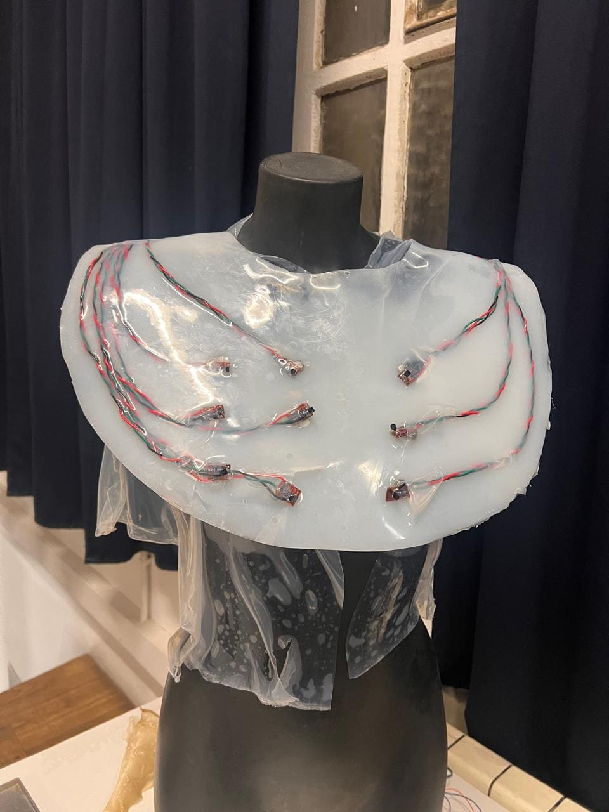
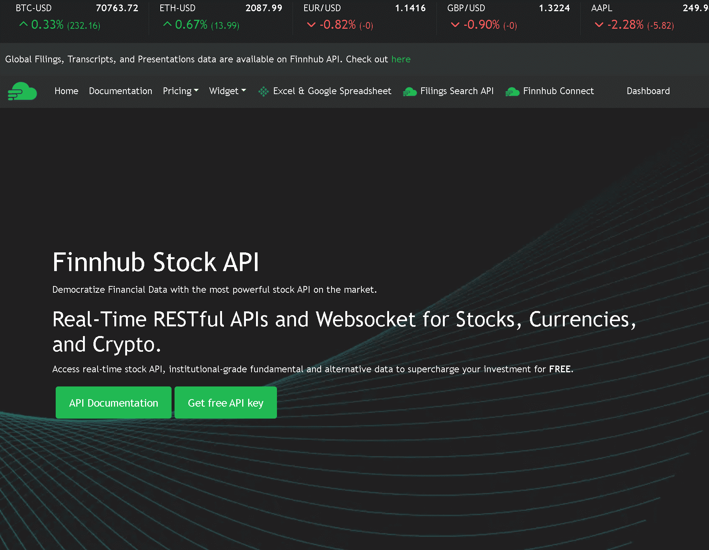
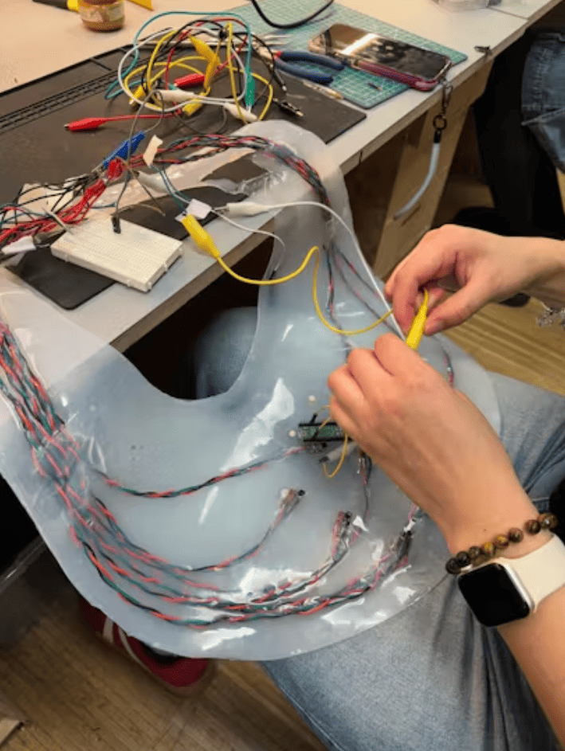
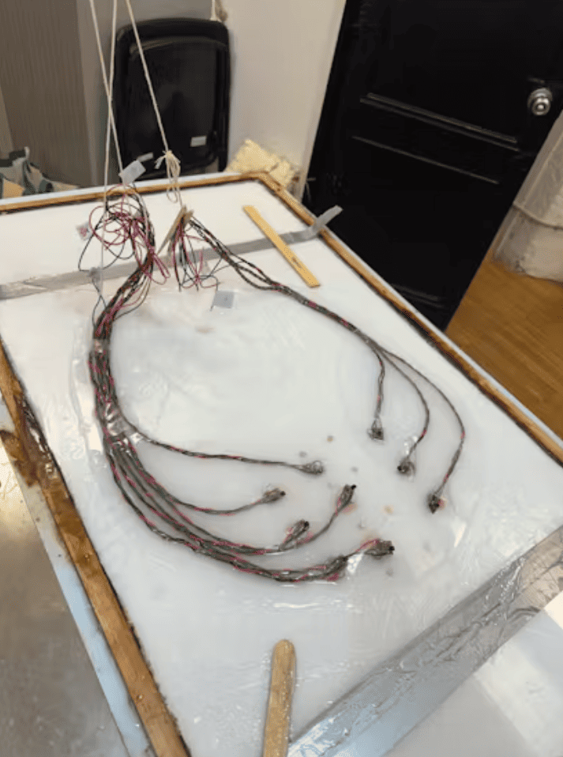
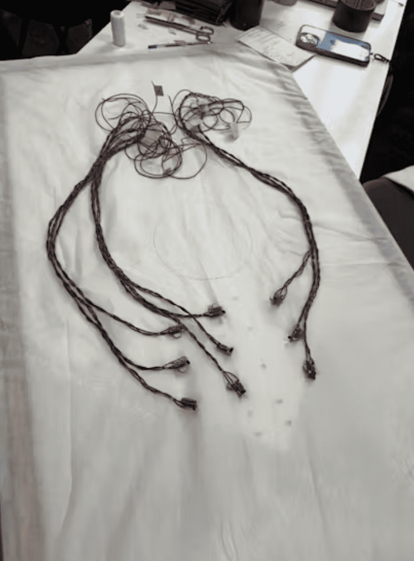
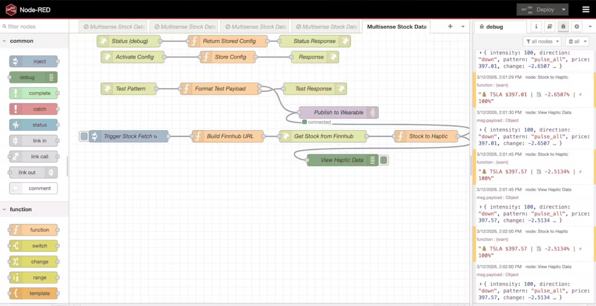
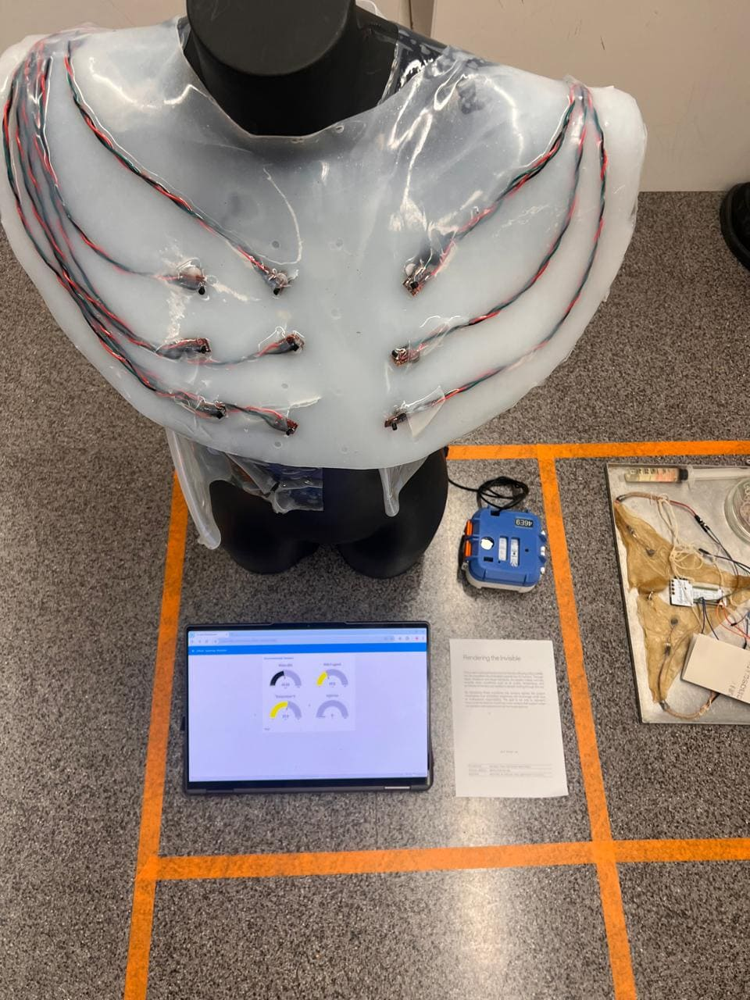
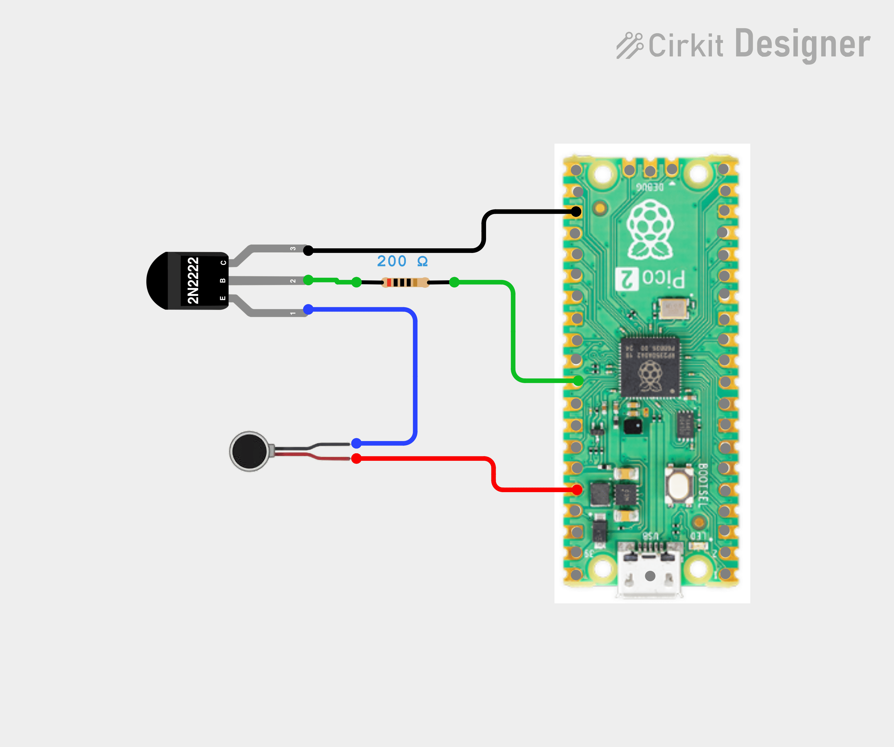

    

        <a href="../..">MDEF</a>
        <a href="https://eradesign.portfolio.site/" target="_blank" rel="noopener noreferrer">Projects</a>
        <a href="../../about/me">About me</a>
    

# StockSense
### Individual Reflective Post

## Project Introduction

This project explored the possibility of communication between two different forms of intelligence. From the beginning, our intention was to connect human perception with environmental intelligence something closer to ecological signals or non human systems. However, finding reliable real time environmental data streams and integrating them within the short timeframe proved difficult. As a result, we pivoted toward the stock market as a data source. While this shift initially felt like a compromise, it allowed us to test the core idea of the project: translating complex data from a collective system into somatic signals that the body can perceive. In that sense, the stock market became a proxy for testing how two different intelligences human and systemic might communicate.

> **Note:** This documentation is a personal reflection. For collaborative context and full technical details, visit:
> **[Full Group Documentation on Hackster.io →](https://www.hackster.io/545047/stocksense-610f0b)**

---

## 1. Cognitive Trace

    
One of the main cognitive traces for me was realizing that we had to accept the limits of what could realistically be achieved in a week. Our initial intention was to connect the wearable to environmental intelligence, but integrating those data streams and building the system in such a short timeframe proved too complex. Instead of forcing an incomplete solution, we decided to compromise and use the stock market API as a working data stream. This allowed us to focus on testing the core idea of the project: translating data from an external system into haptic signals that the body can perceive. In that sense, the project became a first prototype that helps me explore how environmental signals could eventually be translated into sensory experiences that humans can feel and respond to.

---

## 2. Moral Trace

    
Another important process trace was how collaboration unfolded in practice. In theory, the fastest strategy would have been to divide tasks and work in parallel. However, both of us wanted to learn every part of the process from soldering to coding to system integration so we intentionally avoided strict specialization. This created moments where efficiency slowed down. For example, soldering motors cannot realistically be done by two people at once, and when we were working on the platform most of the coding happened on a single computer. At times this meant that one person was actively building while the other observed, asked questions, and tried to understand the logic. While slower, this process made the learning experience more shared and transparent.

---

## 3. Technical Trace

### Material and Mechanical Decisions

We became very excited about the idea of embedding the motors in silicone to create a polished wearable artifact. However, this decision also consumed much more time and material than we anticipated. At one point the silicone failed to cure overnight, which forced us to remove everything and start again with a faster curing material. Because we ran out of both time and silicone, the artifact ultimately shifted from the vest we initially envisioned to something closer to a collar like chest piece. Although this began as a constraint, it ended up shaping the final narrative of the project and its visual identity.

    
    

### System Architecture

We built a system that translates real time stock data into haptic patterns across nine motors arranged in a 3x3 grid on the chest. The data flows from a stock market API through Node RED, then via MQTT protocol to a Raspberry Pi Pico W, which controls the vibration intensity and patterns of each motor individually.

    <h3 style="margin-top: 0;">Technical Challenges</h3>
    
The most persistent challenge was connectivity. We spent hours troubleshooting why the Raspberry Pi Pico W would not connect to WiFi, only to realize that moving to a different room with better signal solved the problem. Another universal fix that worked was simply unplugging and replugging the device. These small moments of frustration became lessons in how infrastructure physical and digital is never as seamless as it appears.

---

## 4. Review and Future Direction

    
The project is not a finished artifact but a working prototype that opens new questions. The wearable, the data translation pipeline, and the platform together demonstrate a possible framework for somatic interfaces that communicate complex systems through the body. For me personally, this prototype is especially valuable because it establishes a technical and conceptual foundation that I can later adapt toward environmental sensing and ecological intelligence the direction that originally motivated the project.

    
The collar form, also took on new meaning through this process. What began as an accident of material constraints became somehow part of the narrative.

---

## 5. What This Prototype Is

    
This is not a finished product. It is a working question. Can we build interfaces that let the body perceive abstract systems directly?

    
The fact that we pivoted from ecological to financial data is part of the narrative. It reveals how infrastructure choices, data availability, API reliability, time constraints shape what becomes possible. The project is as much about these constraints as it is about the final artifact.

---

## 6. Next Steps

    
    

        <h3 style="margin-top: 0;">If we continue developing this project, the priorities would be:</h3>
        <ul style="line-height: 1.8;">
            <li>Exploring different materials, for example, agar agar</li>
            <li>Creating a proper pouch for the microcontroller and battery in the back</li>
            <li>Refining the aesthetic to more closely resemble an Usekh collar</li>
            <li>Testing different body placements to optimize tactile perception based on two point discrimination maps</li>
        </ul>
    

    
    

        <h3 style="margin-top: 0;">Further exploration:</h3>
        
The next layer of development would focus on the data sources themselves.

        <ul style="line-height: 1.8;">
            <li>Reconnecting to the original intention of environmental data streams</li>
            <li>Exploring visual tracking of animal movements using OpenCV as an alternative data source</li>
            <li>Developing more nuanced haptic vocabularies that differentiate between types of change (rate, direction, volatility)</li>
        </ul>
    

    

---

<!-- Slideshow Gallery -->

    
    

        <h2 style="font-size: 1.8rem; font-weight: bold; margin-bottom: 1.5rem;">Project Gallery</h2>
        

            
            

            

            
            <button onclick="prevSlide()" style="position: absolute; top: 50%; left: 1rem; transform: translateY(-50%); background: rgba(255,255,255,0.9); border: none; border-radius: 50%; width: 40px; height: 40px; font-size: 1.5rem; cursor: pointer; display: flex; align-items: center; justify-content: center; z-index: 10;">‹</button>
            <button onclick="nextSlide()" style="position: absolute; top: 50%; right: 1rem; transform: translateY(-50%); background: rgba(255,255,255,0.9); border: none; border-radius: 50%; width: 40px; height: 40px; font-size: 1.5rem; cursor: pointer; display: flex; align-items: center; justify-content: center; z-index: 10;">›</button>
            
            

            

        

        
Use arrows to navigate through project images

    

    
    

        <h2 style="font-size: 1.8rem; font-weight: bold; margin-bottom: 1.5rem;">System Diagram</h2>
        

            
        

    

