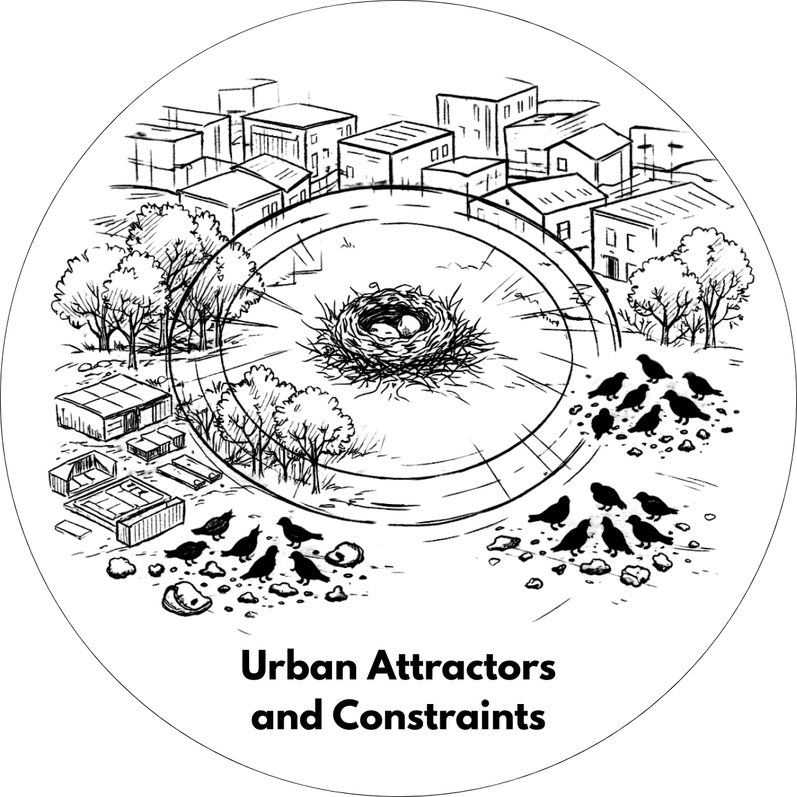
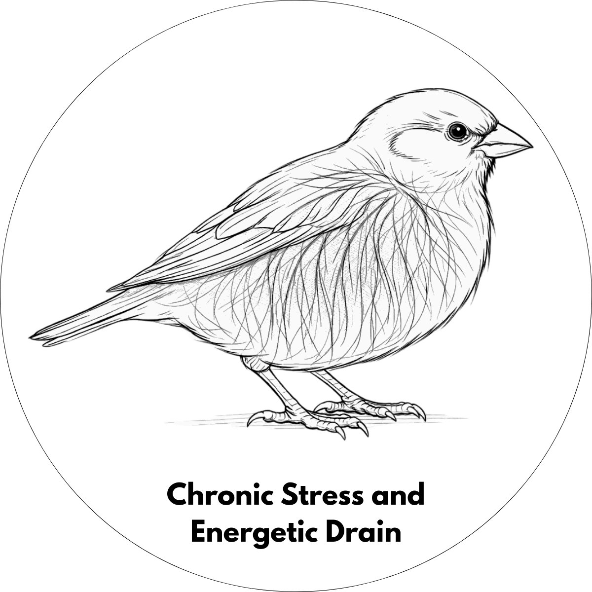
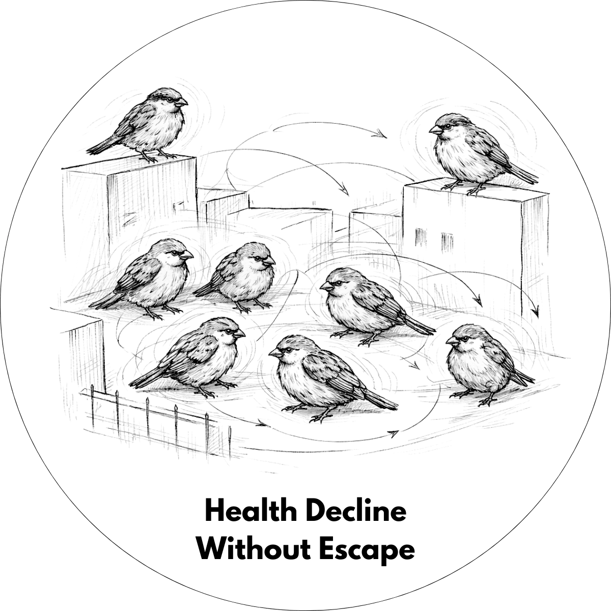

    

        <a href="../..">MDEF</a>
        <a href="https://eradesign.portfolio.site/" target="_blank" rel="noopener noreferrer">Projects</a>
        <a href="../../about/me">About me</a>
    

    

        <!-- Imagen central grande CON FONDO BLANCO -->
        

            

            
        

        
        <!-- Nodo 1 - Parte superior -->
        

            

                
                

                
Click here

            

            

        

        
        <!-- Nodo 2 - Superior derecha -->
        

            

                
                

                
Click here

            

            

        

        
        <!-- Nodo 3 - Inferior derecha -->
        

            

                
                

                
Click here

            

            

        

        
        <!-- Nodo 4 - Parte inferior -->
        

            

                
                

                
Click here

            

            

        

        
        <!-- Nodo 5 - Inferior izquierda -->
        

            

                
                

                
Click here

            

            

        

        
        <!-- Nodo 6 - Superior izquierda -->
        

            

                
                

                
Click here

            

            

        

    

    
    <!-- Panel de información que aparece al hacer clic -->
    

        

            <button class="close-btn">&times;</button>
            

                <h3 class="info-title">House Sparrow</h3>
                
Urban Attractors and Constraints

                
Concentrates sparrows in small spatial ranges (~60 m from nests), especially in densely populated human neighborhoods, where population density correlates more strongly with sparrow health decline than light or noise alone.

                
                
Habitat structure

                
Favors presence near allotments, medium-height tree clusters, and low shrub cover, offering nesting and shelter.

                
                
Anthropogenic food availability

                
Peaks in areas with abundant litter and food waste, creating predictable foraging hotspots.

                
                

                    Urban environments initially function as ecological traps: they offer reliable food and nesting opportunities while masking long-term costs.
                

            

        

    

