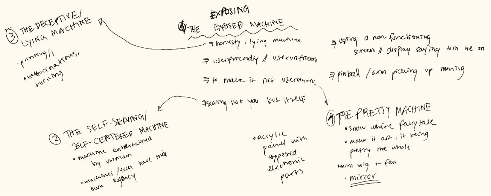
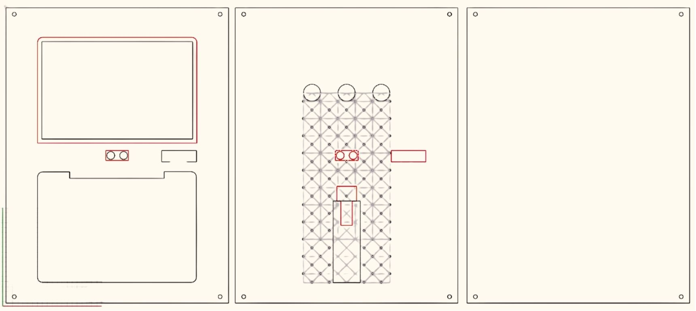
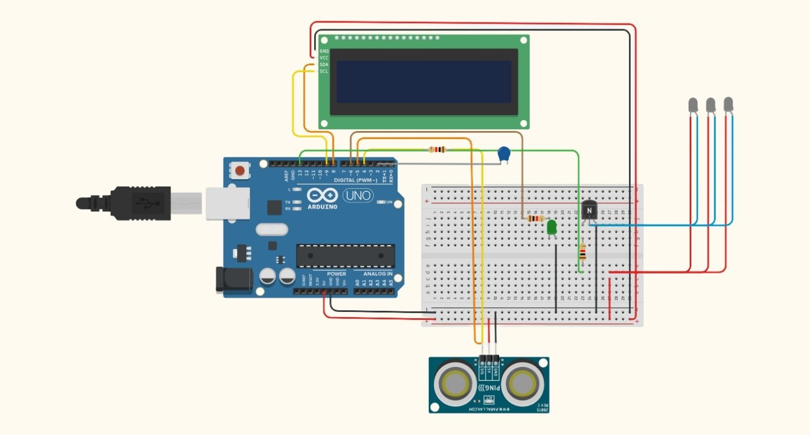

    

        <a href="../..">MDEF</a>
        <a href="../../projects/Portfolio">Projects</a>
        <a href="../../about/me">About me</a>
    

# Meluza: The Deceptive Machine

A project about a self-centered machine that uses beauty to deceive.

<video controls autoplay muted loop width="100%" style="border-radius: 8px; margin: 2rem 0;">
  <source src="../../videos/Meluza.mp4" type="video/mp4">
  Your browser does not support the video tag.
</video>

## Project Introduction

Meluza was born from three simple ideas: a machine that tricks you, a machine that only cares about itself, and a machine designed to be pretty above all else.

Our interest in transparency, both literal and metaphorical, began when we found glasses and started thinking about how things appear versus how they actually work. Using parts from a disassembled MacBook, we built a device that looks attractive and inviting, but behaves in a selfish and deceptive way.

The machine draws you in with its appearance, then frustrates you with messages of rejection and disinterest. It's beautiful, but useless, a mirror that doesn't reflect you back, only its own perfect image.

> **Note:** This documentation is a personal reflexion about the Meluza project. For collaborative context and additional resources, visit:
> 
> **[Full Group Documentation →](https://drive.google.com/drive/folders/1SaJp7rSrbgC6_TBm4SuqNJTPU5xxVxo5?usp=drive_link)**  

## Concept Overview

    
<!-- Left Column -->

        <h3 style="margin-top: 0;">What This Machine Does</h3>
        

            
• Invites you to press a button, reels you in, gets your hopes up...

            
• Blinds your eyes.

            
• Makes you confused.

        

    

    
<!-- Right Column -->

        <h3 style="margin-top: 0;">What This Machine Does NOT Do</h3>
        

            
• Be helpful in any way.

            
• Be useful.

            
• Reflect your image.

        

    

Meluza Machine Concept

## Design Process

First Prototype

Preparing for laser

Iteration Process
<video controls autoplay muted loop width="100%" style="border-radius: 8px; margin: 2rem 0;">
  <source src="../../videos/process.mp4" type="video/mp4">
  Your browser does not support the video tag.
</video>

### Design Elements

    <h3 style="margin-top: 0;">Key Design Components</h3>
    
<strong>Ultrasonic Sensor HC-SR04</strong> Measures distance to detect when users approach the machine, triggering the deceptive interaction sequence.

    
<strong>LCD Display 2004 I2C</strong> Shows the machine's selfish messages, inviting users in only to reject them with words like "Ur not worthy to look at me."

    
<strong>5V recessed LED spotlight with built-in resistor</strong> Creates the blinding light sequence that confuses and disorients users during interaction.

    
<strong>Protoboard</strong> Used to connect and organize all electronic components.

    
<strong>Barduino</strong> The main microcontroller that runs the deceptive logic, controlling sensors, lights, and display messages.

    
<strong>MOSFET IRFZ44N</strong> Controls the power to the bright LEDs, enabling the intense blinking patterns that overwhelm users.

## Technical Implementation

### System Architecture

Schematic Diagram

System Diagram 

### Coding Logic

    <h2 style="font-size: 1.8rem; font-weight: bold; margin-top: 0;">Flow Chart Sequence</h2>
    

        <ol style="line-height: 2;">
            <li><strong>Baseline:</strong> Stay further than 100cm of Proximity Sensor</li>
            <li><strong>Initial Invitation:</strong> LED Displays: "Come touch my gold button"</li>
            <li><strong>User Interaction:</strong> Press gold button (capacitive touch sensor)</li>
            <li><strong>Initial Feedback:</strong> Green LED turns on (0-25s)</li>
            <li><strong>Secondary Invitation:</strong> LED Displays: "Come look inside my screen" (0-6s)</li>
            <li><strong>Visual Stimulation:</strong> Right LEDs switch on (6-8s)</li>
            <li><strong>Disorientation:</strong> Right LEDs blink quickly [50ms on/off] (8-14s)</li>
            <li><strong>Rejection:</strong> LED Displays: "Ur not worthy to look at me" (14-19s)</li>
            <li><strong>Re-engagement:</strong> LED Displays: "Wanna play again?" (19-25s)</li>
        </ol>
    

### Pseudocode Implementation

Initialize sensors, LEDs, screen states
trigger = 100cm

loop:
    read distance
    read touch
    
    if not in sequence:
        if distance > trigger: baseline OFF state
        else if distance <= trigger: show "turn me on"
        if touch detected: start sequence
    
    if in sequence:
        small LED blinks continuously
        screen state + LED behavior based on elapsed time:
            0–6s: peek message, strong LEDs off
            6–8s: strong LEDs solid on
            8–14s: strong LEDs fast blink
            14–19s: not worthy message
            19–25s: try again message
    
    if sequence finished: reset everything to OFF