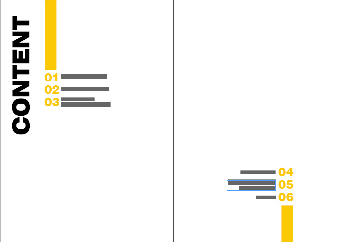
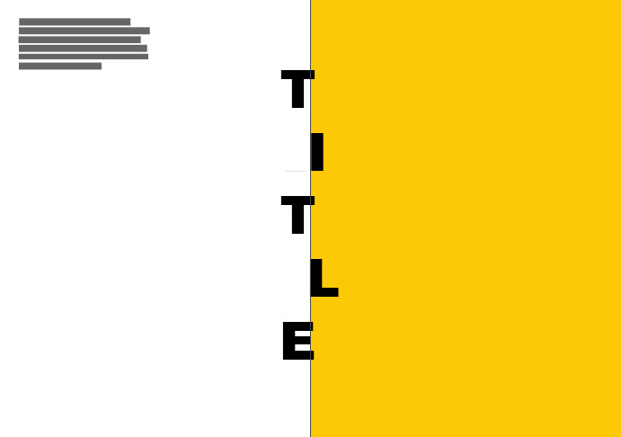
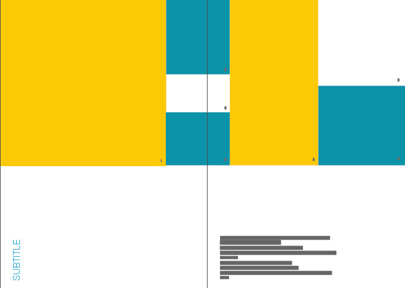

    

        <a href="../..">MDEF</a>
        <a href="https://eradesign.portfolio.site/" target="_blank" rel="noopener noreferrer">Projects</a>
        <a href="../../about/me">About me</a>
    

<h2>Short Proposal</h2>

This pictorial proposes an open visual exploration of multispecies justice, without fixing a single subject, scale, or outcome. Rather than presenting conclusions, it assembles images, textures, overlays, and partial texts to speculate on how non-human lives intersect with urban environments and human-centered systems. Inspired by visual essays the work treats images as the main thinking tool, layering, obscuring, and contrasting elements to surface relationships that are usually overlooked. The format remains fluid and modular, functioning as a provisional map of questions, observations, and possible directions, allowing the project to evolve as new species, sites, and perspectives emerge.

<h2>Draft Pictorial</h2>

The current pictorial draft takes the form of a series of images arranged within a minimal and flexible layout, where visual material leads the narrative. Yellow and blue are used as provisional colors to differentiate images, textures, and visual layers, rather than as a fixed palette. At this stage, color operates as a placeholder for different material qualities, atmospheres, or sensory conditions, and is expected to shift as the project develops.

    

        

            
        

        

            
        

        

            
        

        

            
        

        

            
        

        

            
        

        

            
        

    

    
    <button class="slider-btn prev-btn">‹</button>
    <button class="slider-btn next-btn">›</button>

White space is intentionally present, creating pauses between images and text, and allowing each element to be read independently while still contributing to an overall flow. The emphasis remains on images as carriers of meaning, with text acting as a subtle guide rather than an explanation. This draft functions as an exploratory structure, testing rhythm, contrast, and visual hierarchy, rather than a finalized composition.

