

    

        <a href="../..">MDEF</a>
        <a href="https://eradesign.portfolio.site/" target="_blank" rel="noopener noreferrer">Projects</a>
        <a href="../../about/me">About me</a>
    

## Short Proposal

This pictorial proposes an open visual exploration of multispecies justice, without fixing a single subject, scale, or outcome. Rather than presenting conclusions, it assembles images, textures, overlays, and partial texts to speculate on how non-human lives intersect with urban environments and human-centered systems. Inspired by visual essays the work treats images as the main thinking tool, layering, obscuring, and contrasting elements to surface relationships that are usually overlooked. The format remains fluid and modular, functioning as a provisional map of questions, observations, and possible directions, allowing the project to evolve as new species, sites, and perspectives emerge.

## Draft Pictorial

The current pictorial draft takes the form of a series of images arranged within a minimal and flexible layout, where visual material leads the narrative. Yellow and blue are used as provisional colors to differentiate images, textures, and visual layers, rather than as a fixed palette. At this stage, color operates as a placeholder for different material qualities, atmospheres, or sensory conditions, and is expected to shift as the project develops.

    

        

            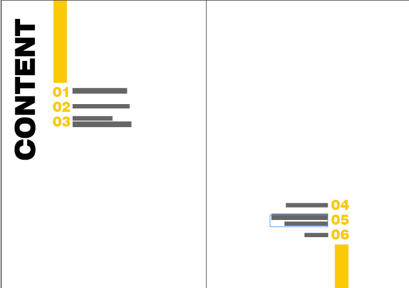
        

        

            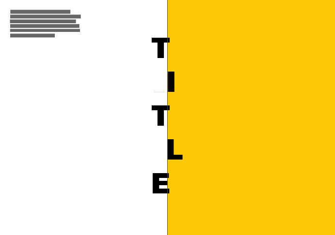
        

        

            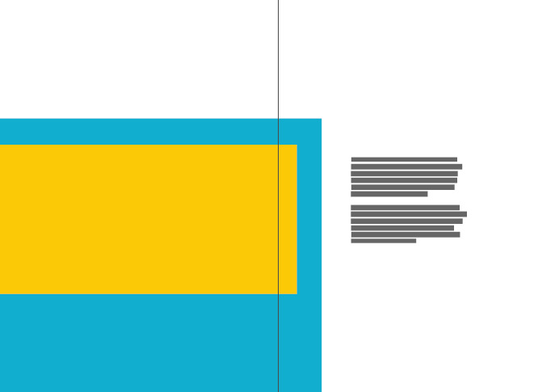
        

        

            
        

        

            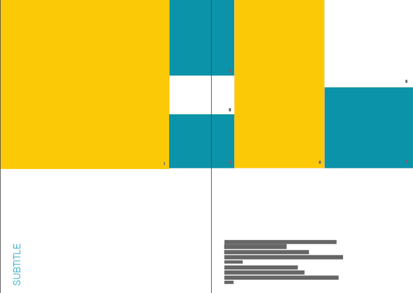
        

        

            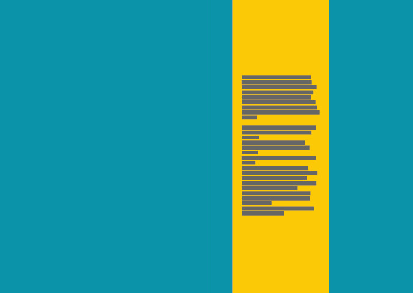
        

        

            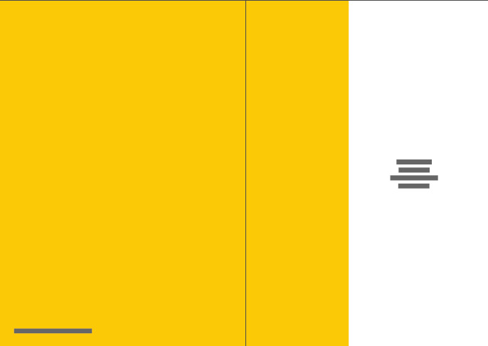
        

    

    
    <button class="slider-btn prev-btn">‹</button>
    <button class="slider-btn next-btn">›</button>

White space is intentionally present, creating pauses between images and text, and allowing each element to be read independently while still contributing to an overall flow. The emphasis remains on images as carriers of meaning, with text acting as a subtle guide rather than an explanation. This draft functions as an exploratory structure, testing rhythm, contrast, and visual hierarchy, rather than a finalized composition.

## Draft publication

This draft publication brings together the research I have developed so far throughout the project. It compiles the theoretical framework and references that currently inform the direction of the work. And this is only a provisional version.

    

        

            <!-- Portada - slide 1 (va sola) -->
            

                

                    

                        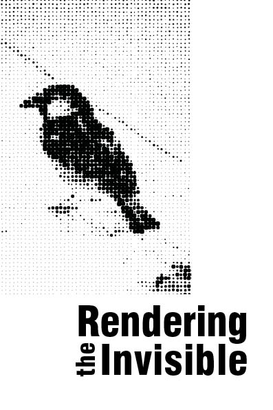
                    

                    

                

            

            
            <!-- Slides 2-3 (van juntas) -->
            

                

                    

                        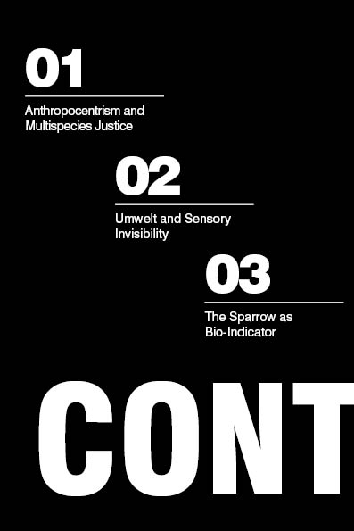
                    

                    

                        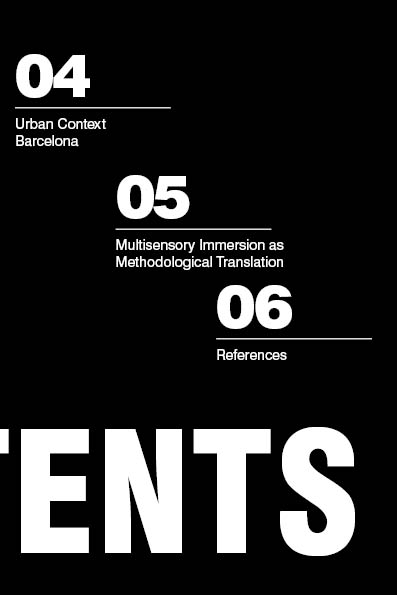
                    

                

            

            
            <!-- Slides 4-5 (van juntas) -->
            

                

                    

                        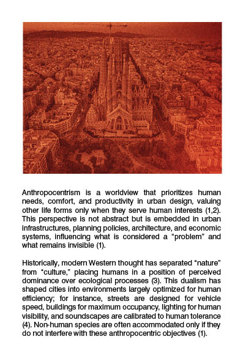
                    

                    

                        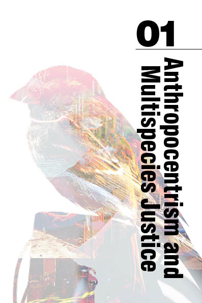
                    

                

            

            
            <!-- Slides 6-7 (van juntas) -->
            

                

                    

                        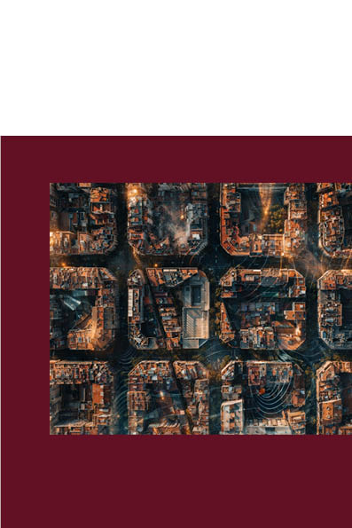
                    

                    

                        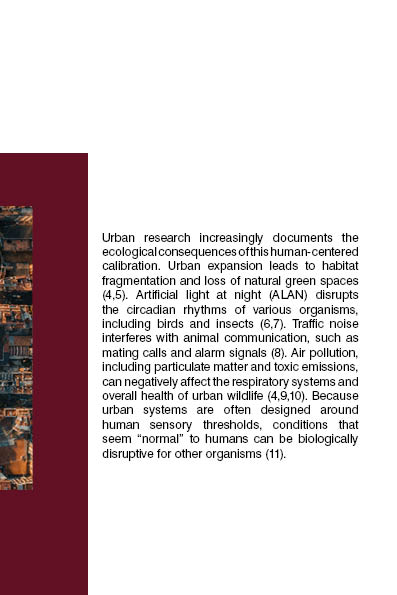
                    

                

            

            
            <!-- Slides 8-9 (van juntas) -->
            

                

                    

                        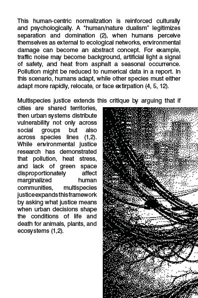
                    

                    

                        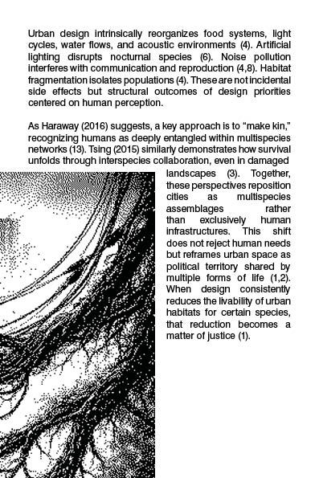
                    

                

            

            
            <!-- Slides 10-11 (van juntas) -->
            

                

                    

                        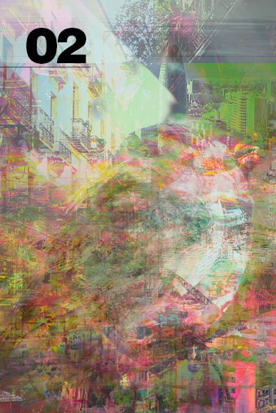
                    

                    

                        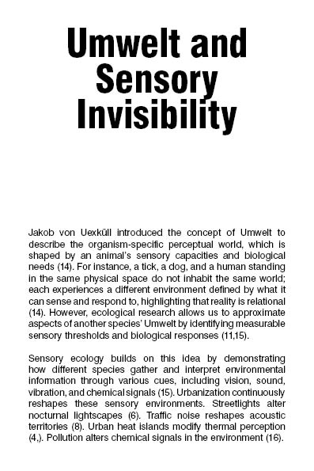
                    

                

            

            
            <!-- Slides 12-13 (van juntas) -->
            

                

                    

                        
                    

                    

                        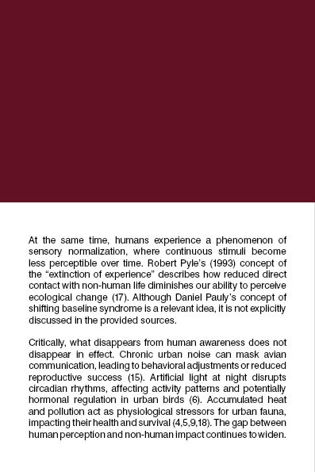
                    

                

            

            
            <!-- Slides 14-15 (van juntas) -->
            

                

                    

                        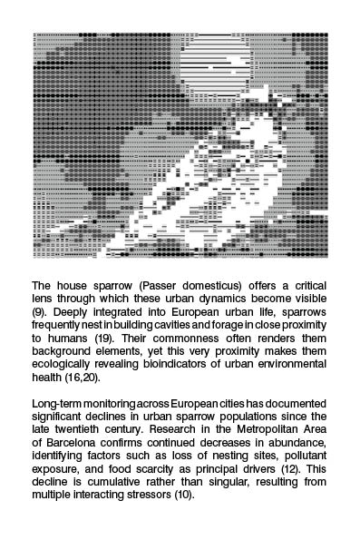
                    

                    

                        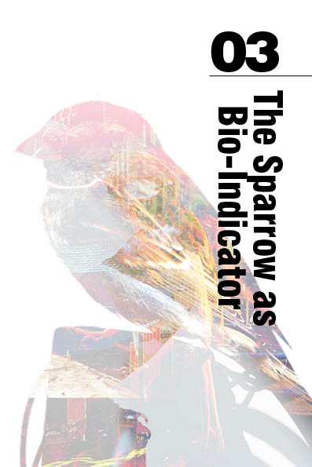
                    

                

            

            
            <!-- Slides 16-17 (van juntas) -->
            

                

                    

                        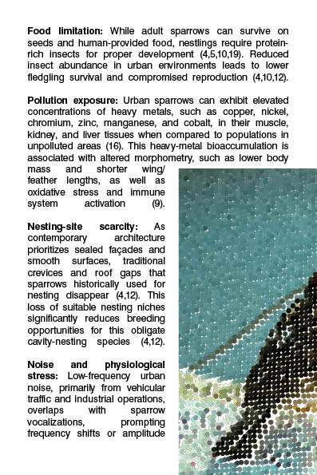
                    

                    

                        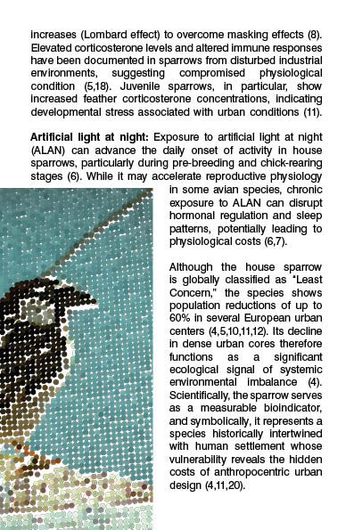
                    

                

            

            
            <!-- Slides 18-19 (van juntas) -->
            

                

                    

                        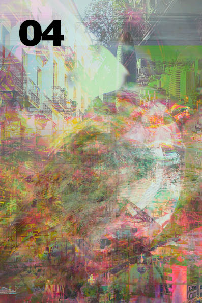
                    

                    

                        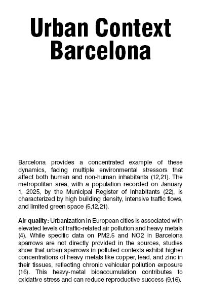
                    

                

            

            
            <!-- Slides 20-21 (van juntas) -->
            

                

                    

                        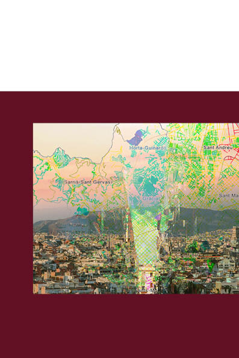
                    

                    

                        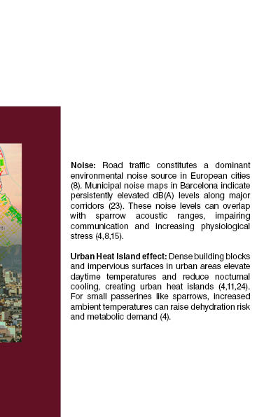
                    

                

            

            
            <!-- Slides 22-23 (van juntas) -->
            

                

                    

                        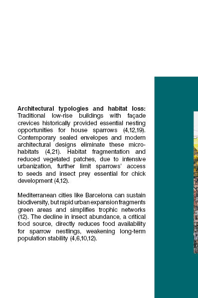
                    

                    

                        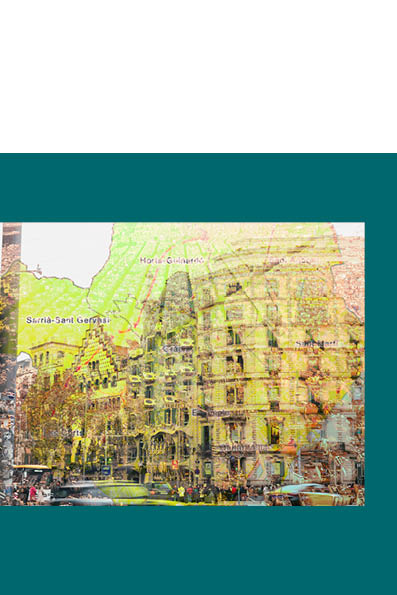
                    

                

            

            
            <!-- Slides 24-25 (van juntas) -->
            

                

                    

                        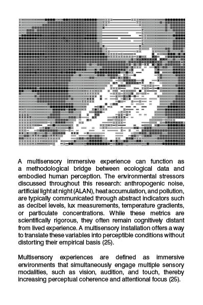
                    

                    

                        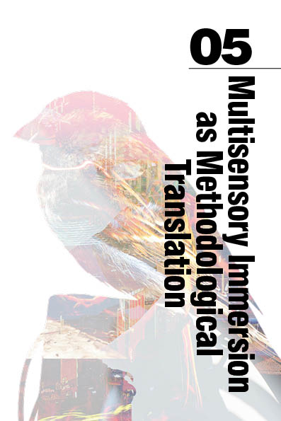
                    

                

            

            
            <!-- Slides 26-27 (van juntas) -->
            

                

                    

                        
                    

                    

                        
                    

                

            

            
            <!-- Slides 28-29 (van juntas) -->
            

                

                    

                        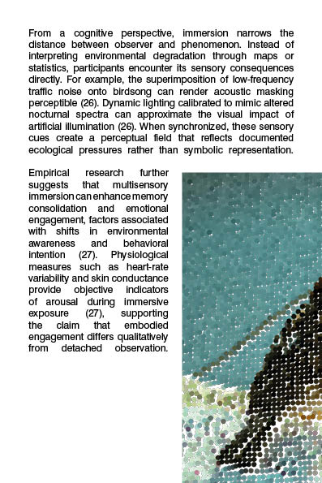
                    

                    

                        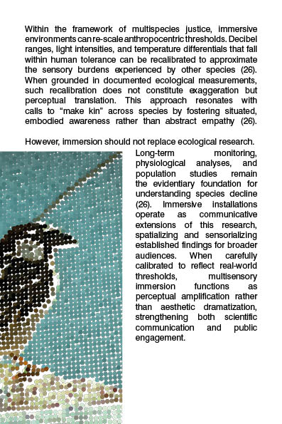
                    

                

            

            
            <!-- Slides 30-31 (van juntas) -->
            

                

                    

                        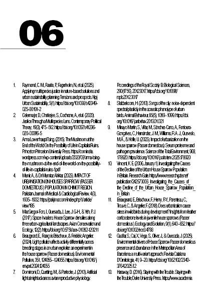
                    

                    

                        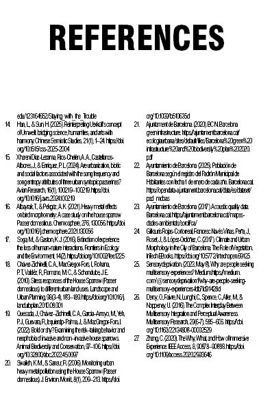
                    

                

            

            
            <!-- Última slide - 32 (va sola) -->
            

                

                    

                    

                        
                    

                

            

        

        
        <button class="book-btn prev-book-btn">‹</button>
        <button class="book-btn next-book-btn">›</button>
    

    
    

<!-- ========== NUEVA SECCIÓN: SNAPSHOT - SPEED DATING ========== -->
<h2>Snapshot - speed dating</h2>

    <!-- Contenedor principal con imagen y entrevista -->
    

        <!-- Columna izquierda: imagen SCARS -->
        

            

                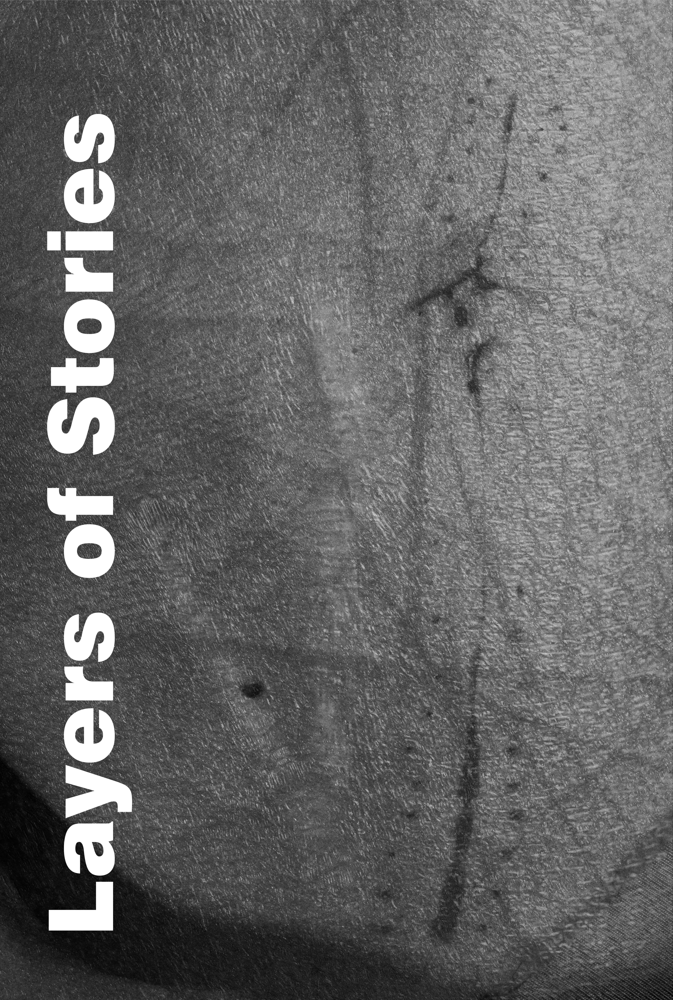
                <!-- Elemento decorativo que refuerza el tema de "cicatriz" -->
                

            

        

        
        <!-- Columna derecha: entrevista interactiva -->
        

            

                <!-- Pregunta 1 -->
                

                    
What a scar means?

                    
More understanding

                

                
                <!-- Pregunta 2 -->
                

                    
What did you decide not to include that you believe would have been easy or popular choice?

                    
Physical scars not emotional scars
 
Not only images

                

                
                <!-- Pregunta 4 -->
                

                    
What method limited your thinking as much as it helped it?

                    
Documentation - consistance
 
Keep circulating and adding more

                

                
                <!-- Pregunta 6 -->
                

                    
Which context is doing the most invisible work in your project?

                    
Sound

                

                
                <!-- Pregunta 8 -->
                

                    
Misuse

                    
Empathy

                

    
                
                <!-- Pregunta 10 -->
                

                    
What material does your project secretly want to be made of, even if it isn’t made out of a material?

                    
Latex, fake skin

                

                
                <!-- Pregunta 11 -->
                

                    
If your project had to be explained only through an image on the cover of a zine, what would not be shown?

                    
A face

                

            

        

    

