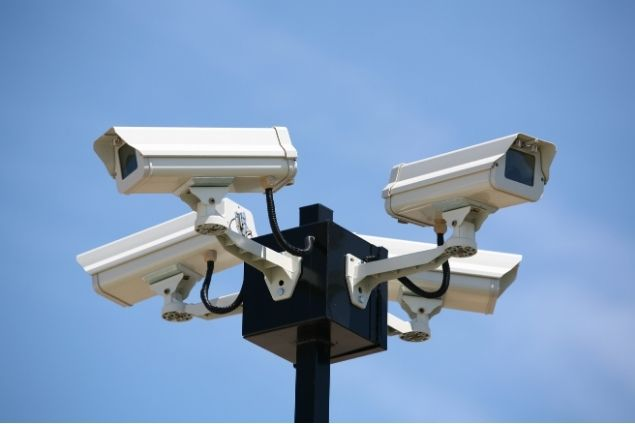
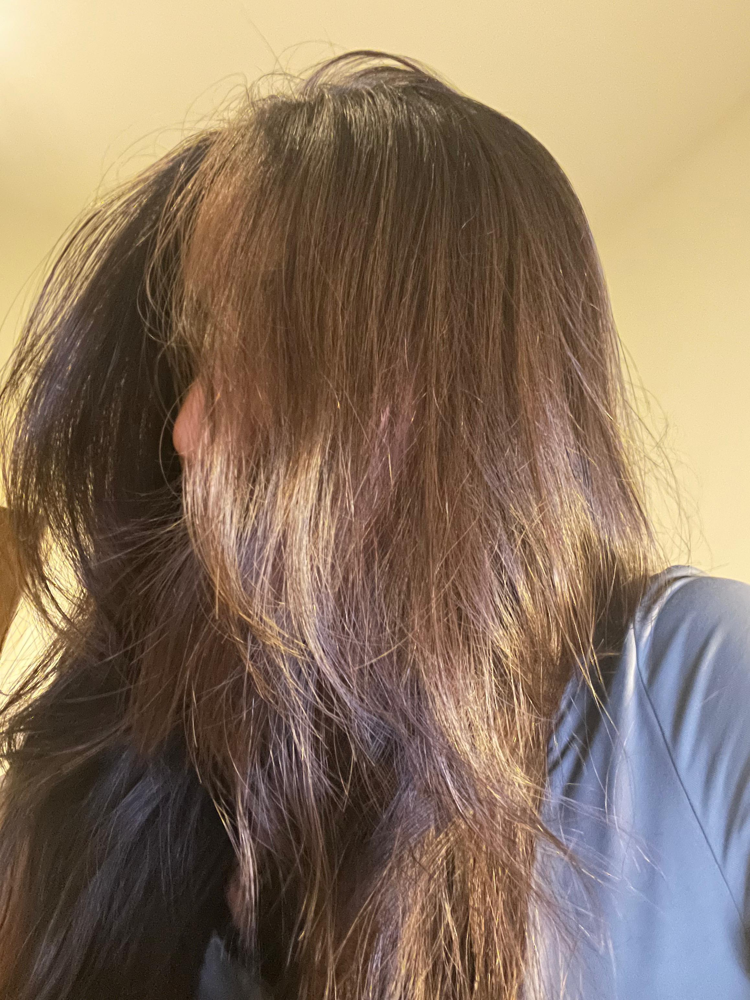

    

        <a href="../..">MDEF</a>
        <a href="../../projects/Portfolio">Projects</a>
        <a href="../../about/me">About me</a>
    

# Becoming Prosthetic
To be the best version of ourselves once sounded like an act of progress, a cleaner, faster, optimized human. Yet, as I explored what a prosthesis could be, that narrative began to dissolve. The more I extended the body, the less human it felt, and paradoxically, the more alive.

A prosthesis is not only an addition, it is a negotiation, between the body and the world, between intimacy and distance, between control and surrender. The prosthesis taught me how to feel again, how to be present in my own body, aware of its limits and its connections.

Each piece became a small experiment in relation and transformation. Through [BookGrip](#bookgrip), I relearned slowness, the intelligence of holding, of pausing, of thinking with the body. Through [Listening Extensions](#listening-extensions), I imagined new ways of connecting to non-human rhythms, becoming part-plant, part-signal, part-ear. Through [To Be Judged](#to-be-judge), I experienced the tension of surveillance, how the gaze of another can become an extension of both control and vulnerability.

Each work became a question rather than a solution.
What if to evolve is to hybridize?
What if to become more is to dissolve the borders that keep us separate?

Manel de Aguas speaks of becoming a cyborg, not as a distant future, but as a present condition, where new organs of perception redefine what it means to be human. Thomas Thwaites reminds us that "the body is the first tool we use to interact with the world." If that is true, then every prosthesis, physical, digital, or emotional, continues that dialogue.

To be prosthetic is to exist in relation. To be human is already to be multiple: technological, biological, cultural, environmental.
The best version of ourselves may not be the one that rises above, but the one that learns to attune, to evolve in empathy, to listen through the skin, to sense the invisible threads that bind us to everything else.

---

# BookGrip

<video controls autoplay muted loop width="100%" style="border-radius: 8px; margin: 2rem 0;">
  <source src="../../videos/BookGrip.mp4" type="video/mp4">
  Your browser does not support the video tag.
</video>

Prosthetics go beyond their traditional function. They are not tools to fix or replace, but extensions that question how we evolve.

BookGrip is a prosthesis that forces the body to hold a book again, to pause, to feel its weight, and to reconnect with knowledge through touch.
It reminds us that being the best version of ourselves isn't always about progress, but about remembering what we've forgotten.

---

# Listening Extensions

<video controls autoplay muted loop width="100%" style="border-radius: 8px; margin: 2rem 0;">
  <source src="../../videos/ListeningExtensions.mp4" type="video/mp4">
  Your browser does not support the video tag.
</video>

This prosthesis explores the idea of human–nature connection beyond enhancement.
Made of wires, threads, and branches, it acts as an interface of sensitivity, a network that expands the human body's perception toward the environment.

It imagines a future where we grow with our surroundings instead of apart from them.
Where technology and nature intertwine, and the body becomes a bridge between both.

---

# To be judge

We played a game of surveillance, half of us became subjects, half became detectives. 
For thirty minutes, I was followed without knowing by whom, and for another thirty, 
I became the one who watched. The constant awareness of being seen changed the way I moved, 
the way I existed.

<h3>Subject</h3>

  <!-- Primer párrafo - texto completo -->
  

    

      My prototype was my own hair. I usually keep it tied with a hair clip, but this time I let it loose, it became my prosthesis, my shield. The idea of someone following me made me feel anxious, so hiding from my own Detective behind myself seemed like the only thing I could control.
    

  

  <!-- Segundo párrafo - imagen y texto lado a lado -->
  

    
    
  

      

        The surveillance started at 12:17. Some of us went to the rooftop, but the sun was too bright so after a few minutes I went downstairs, trying to shake off the feeling of being observed. My original plan was to stay still, to be boring and pretend it was a normal day, but the discomfort pushed me to move. So I ran away from my detective and wandered without direction, not knowing where to go.
      

      

        By 12:40, I returned to IAAC and ran into Ale and Aishwarya. We walked together toward the coffee shop and then back to the classroom.
      

      

        Even though I know my phone listens, that cameras watch from every corner, that I'm theoretically being observed all the time, knowing that someone was actually following me was completely different. It made the abstract fear tangible. I felt panic rise in moments I couldn't explain, and even after I lost my Detective, I couldn't shake the feeling of being pursued.
      

    

  

<h3>Detective</h3>

As the detective, I tried to be discreet, to observe without being noticed.
At 13:02, the subject was working intensely on the computer with Armin, probably something related to the webpage.
At 13:11, the subject closed the laptop, packed a few things, and by 13:12 was gone. I lost the subject almost immediately, 
wandering through the building trying to find them again.

When the subject suggested to continue the game, I followed once more.
At 14:01, the subject joined a group on the terrace, Ayal, Max, Armin, talking, laughing, sharing songs.
The subject recommended "Cosa sarà" for sad moments, "Cumbia japonesa" for cooking, "Ella baila sola" for parties, 
and chose bossa nova as their music for stress, though confessed they would rather play techno.

Each song revealed a different version of the subject, a small window into how they move through moods and moments.
Trying to document them felt strange, I didn't want to intrude, yet every step I took made my presence more visible.
In the end, being the observer felt just as exposed as being observed.

 