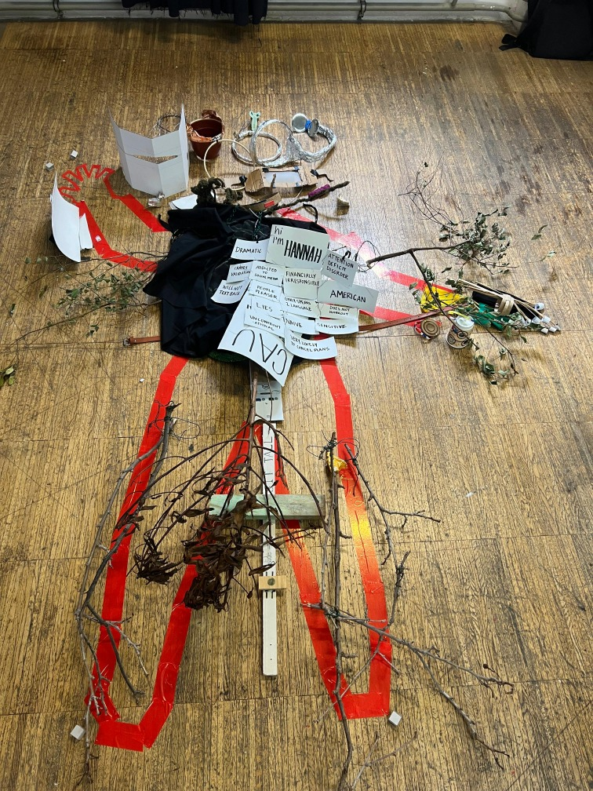
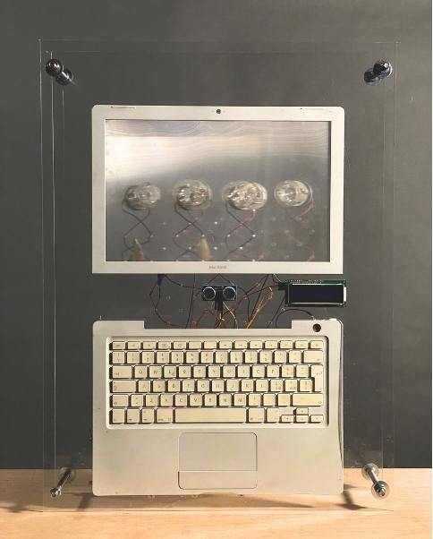
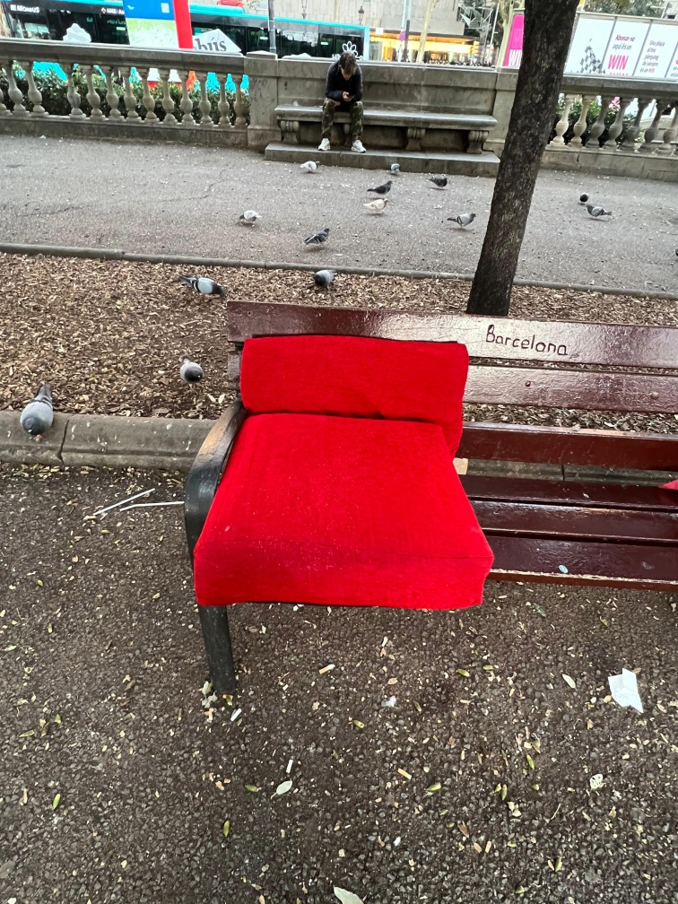

    

        <a href=".">MDEF</a>
        <a href="projects/Portfolio">Projects</a>
        <a href="about/me">About me</a>
    

    

        <h1 class="main-title">MDEF Projects</h1>
        

           
Welcome to my journey through the <a href="https://mdef.fablabbcn.org/" target="_blank" style="font-weight: bold; color: #1976d2; text-decoration: none;">Master in Design for Emergent Futures (MDEF)</a>, a program by Fab Lab Barcelona and IAAC. This space documents the ideas, experiments, and reflections that shaped my learning process, from early prototypes to collective explorations.

            
Join me as I navigate the projects, collaborations, and discoveries that defined this stage of my path as a designer.

        

    

    

        

            <a href="Otherness/Prosthesis" class="card">
                
                <h3>Prosthesis</h3>
                
A research on extensions that question what it means to be human in a hybrid world.

            </a>

 <a href="conceptual/conceptual/" class="card">
                
                <h3>Initial Ideas</h3>
                
Early explorations that became the foundation of future projects.

            </a>

  <a href="Otherness/Other-intelligences/" class="card">
                 
                <h3>Other Intelligences</h3> 
                
Avoid human-centric assumptions to engage with other intelligences.
 
            </a> 

  <a href="Unpacking/Unpacking/" class="card">
                
                <h3>Unpacking Technologies</h3>
                
To examine our relation with technology.

            </a>

  <a href="Machine/Machine/" class="card">
                
                <h3>Machine Paradox</h3>
                
To expand the notion of what a machine might be.

            </a>

  <a href="studio/studio/" class="card">
                
                <h3>Studio</h3>
                
Design, experimentation, and material explorations.

            </a>
        

    

