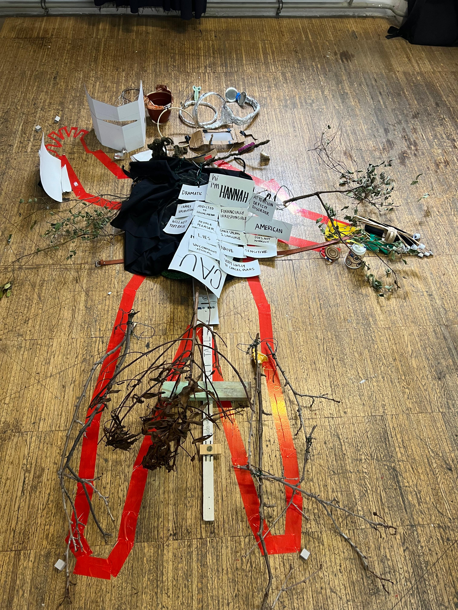
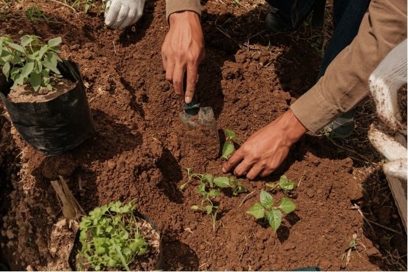
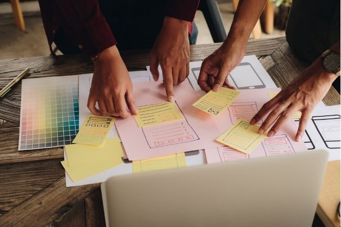
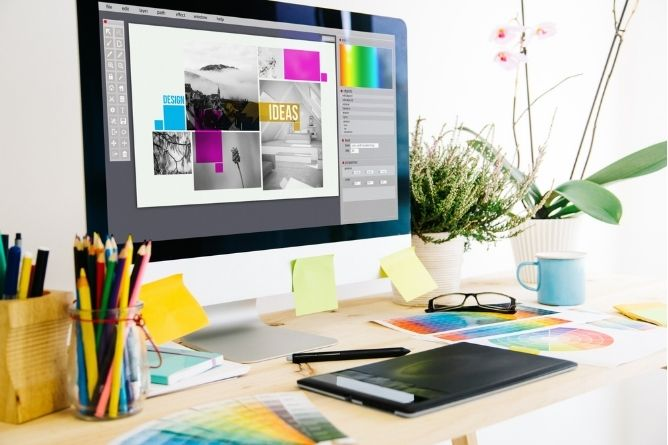

    

        <a href=".">MDEF</a>
        <a href="projects/Portfolio">Projects</a>
        <a href="about/me">About me</a>
    

# MDEF Projects 

Welcome to my journey through the [**Master in Design for Emergent Futures (MDEF)**](https://mdef.fablabbcn.org/), a program by Fab Lab Barcelona and IAAC. This space documents the ideas, experiments, and reflections that shaped my learning process, from early prototypes to collective explorations. 

Join me as I navigate the projects, collaborations, and discoveries that defined this stage of my path as a designer. 

--- 

## My Journey

<a href="Prosthesis/Prosthesis.md" class="card">
  
  <h3>Prosthesis</h3>
  
Exploring assistive technologies and wearable devices.

</a>

<a href="project/project/" class="card">
  
  <h3>Initial Ideas</h3>
  
Early explorations that became the foundation of future projects.

</a>

<a href="term1/01-Bootcamp/" class="card">
   
  <h3>Bootcamp</h3> 
  
Hands-on learning, rapid prototyping, and collaboration.
 
</a> 

<a href="term1/02-Atlas of Weak Signals/" class="card">
   
  <h3>Atlas of Weak Signals</h3> 
  
Researching emerging signals and future-oriented thinking.
 
</a> 

<a href="digi/digi/" class="card"> 
   
  <h3>Digi</h3> 
  
Digital tools and interactive systems.
 
</a> 

<a href="studio/studio/" class="card"> 
   
  <h3>Studio</h3> 
  
Design, experimentation, and material explorations.
 
</a> 

